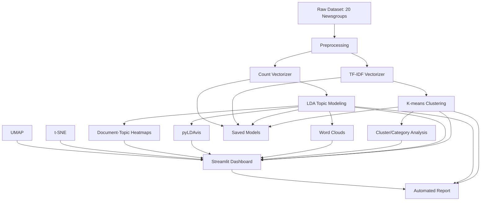

# TopicVista — Discover Hidden Stories in News Data

TopicVista is a complete, modular pipeline for unsupervised document clustering and topic modeling on the classic 20 Newsgroups dataset. It leverages K-means clustering and Latent Dirichlet Allocation (LDA) to uncover hidden themes and clusters in news data, featuring robust preprocessing, interactive analysis, and advanced visualizations.

---

## 🚀 Features

- **K-means Clustering** and **LDA Topic Modeling**  
  (Built with scikit-learn & Gensim)
- **Parallelized Preprocessing**  
  (spaCy & NLTK for batch cleaning, tokenization, lemmatization)
- **Interactive Streamlit Dashboard**  
  - Multi-page UI for prediction, clustering, topic analysis, and advanced analytics
- **Visualizations**  
  - t-SNE, UMAP, word clouds, pyLDAvis, cluster/category analysis, document-topic heatmaps
- **Automated Reporting**  
  - Markdown report generation (`report.py`)
- **Advanced Analytics**  
  - Cluster purity, coherence scores, mutual information, completeness
- **Model Persistence**  
  - Save/load all models and matrices for reproducibility
- **Extensible, Modular Codebase**  
  - Add new algorithms, visualizations, pages with ease

---

## 🗂️ Project Structure

- `main.py`  
  Core analysis pipeline (`NewsGroupsAnalyzer` class)
- `app.py`  
  Streamlit dashboard (`streamlit run app.py`)
- `models.py`  
  Train and save all models
- `preprocess_and_save.py`  
  Preprocess and save matrices without retraining
- `visualization_utils.py`, `text_utils.py`  
  Utility modules for plotting and text processing
- `report.py`  
  Automated markdown report generation
- `trained_models/`  
  Saved models, vectorizers, and matrices
- `tests/`  
  Unit tests for core modules
- `twenty+newsgroups/`  
  Raw dataset

---

## ⚙️ Setup

1. **Install dependencies**
   ```bash
   pip install -r requirements.txt
   ```
2. **Download spaCy model** (if not present)
   ```bash
   python -m spacy download en_core_web_sm
   ```
3. **Prepare dataset**
   - Ensure the 20 Newsgroups data is in `twenty+newsgroups/20_newsgroups/`

---

## ▶️ Usage

- **Train models**
  ```bash
  python models.py
  ```
- **Preprocess only** (no retrain)
  ```bash
  python preprocess_and_save.py
  ```
- **Run Streamlit app**
  ```bash
  streamlit run app.py
  ```
- **Generate report**
  ```bash
  python report.py
  ```
- **Run tests**
  ```bash
  python -m unittest discover tests
  ```

---

## 💡 How It Works

1. **Load & Clean Data:**  
   Documents are loaded and preprocessed in parallel batches for speed.
2. **Vectorization:**  
   TF-IDF and CountVectorizer transform text to numerical form.
3. **Clustering:**  
   K-means groups documents into clusters.
4. **Topic Modeling:**  
   LDA (both scikit-learn and Gensim) discovers latent topics.
5. **Visualization:**  
   t-SNE, UMAP, word clouds, pyLDAvis, cluster/category/topic analyses.
6. **Interactive App:**  
   Streamlit dashboard lets users explore clusters, predict topics, and analyze document distributions.

---

## 🏗️ System Architecture 



---

## 🧪 Advanced Analytics

- **Cluster Purity & Metrics:**  
  Adjusted Rand Index, Homogeneity, Normalized Mutual Info, Completeness
- **Category Distribution:**  
  Analyze how news categories map to clusters
- **Document-Topic Distribution:**  
  Interactive heatmaps and probability plots

---

## 📈 Extending

- Add new clustering or topic modeling methods in `main.py`
- Add visualizations in `visualization_utils.py`
- Add Streamlit pages in `app.py`
- Test on other datasets by updating the data path

---

## 🛠️ Dependencies

- **scikit-learn:** Clustering, evaluation
- **Gensim:** Topic modeling
- **NLTK/spaCy:** NLP preprocessing
- **Streamlit:** Interactive dashboard
- **pyLDAvis:** Topic visualization
- **Matplotlib/Seaborn:** Plotting

---

## 🧑‍💻 Developer Details


**Harsh Mishra**  
*Summer Intern | Data Science*

- **Contact No:** 8573001132
- **Email ID:** harshmishra1132@gmail.com
- **StudentId:** CT_CSI_DS_6094
- **Batch:** batch 2

---

## 📝 License

MIT License.

---

## 🤝 Contributing

PRs and suggestions are welcome! Please open an issue for bugs or feature requests.

---

## 📚 References

- [20 Newsgroups Dataset](http://archive.ics.uci.edu/ml/datasets/Twenty+Newsgroups)
- [scikit-learn Documentation](https://scikit-learn.org/stable/)
- [Gensim Documentation](https://radimrehurek.com/gensim/)
- [Streamlit Docs](https://docs.streamlit.io/)

---
